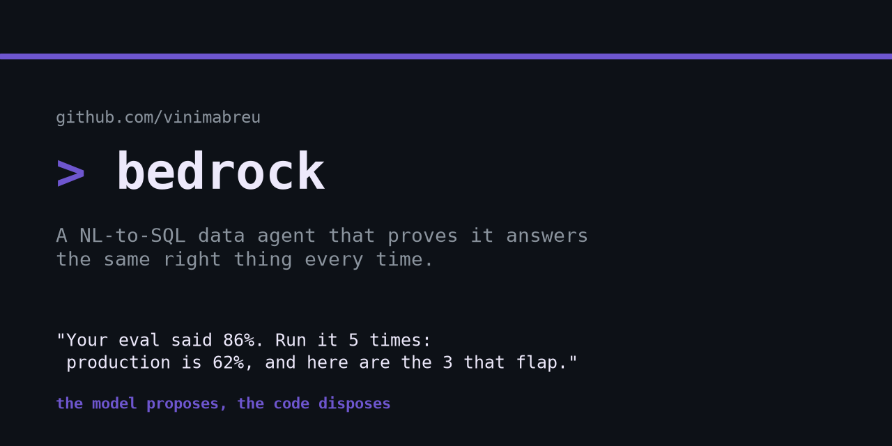
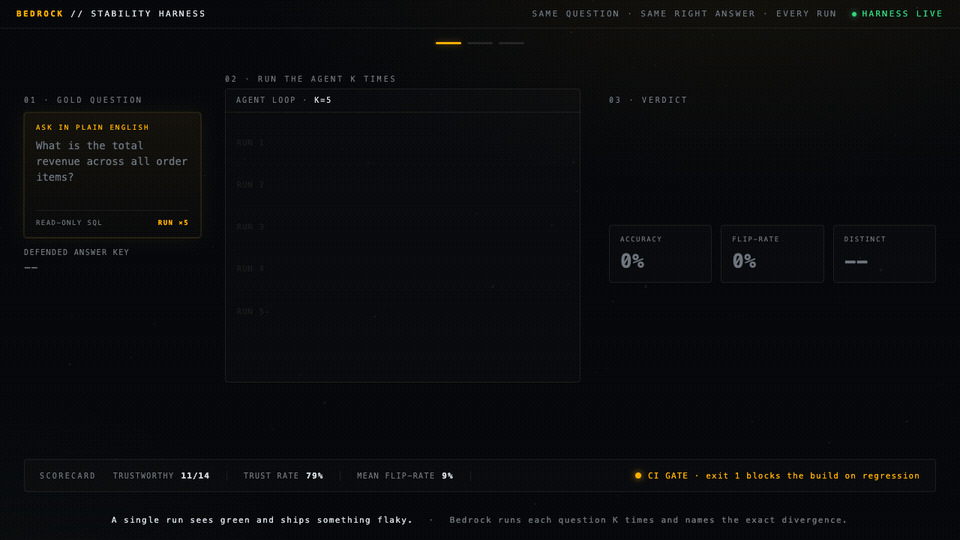

# bedrock

**A natural-language-to-SQL data agent that proves it answers the same right thing every time.**



Everyone can wire an LLM to their database. Almost nobody can answer the only
question that matters in production: *how often is it actually right, and will I
know the day it quietly stops being?*

Bedrock answers a database in plain English with safe, read-only, cited SQL, and
then does the thing a demo skips: it runs each business-critical question **K
times**, compares every answer to a defended answer key, and flags the questions
that **flap** before they reach a customer. It turns "works in the demo, breaks
in production" from a vibe into a number and a build that fails when the agent
gets less trustworthy.



```
================================================================
BEDROCK STABILITY SCORECARD
================================================================
11/14 questions answered correctly and identically across 5 runs.
  3 FLAP (a different answer depending on the run)

trust rate 79%   mean accuracy 91%   mean flip-rate 9%

* total_revenue: What is the total revenue across all order items?
  accuracy 60% across 5 runs, flip-rate 40%, 2 distinct answers
  answer key: revenue=2780222.9
    [MATCHES KEY] 3/5 runs: revenue=2780222.9
      sql: SELECT ROUND(SUM(quantity * unit_price), 2) ... FROM order_items
    [WRONG]       2/5 runs: revenue=1382120.3
      sql: SELECT ROUND(SUM(unit_price), 2) ... FROM order_items   -- dropped quantity

* revenue_completed: ... 2/5 runs silently drop the status='completed' filter
* revenue_computers: ... 2/5 runs typo the category and return NULL
```

Your single-run eval would have shipped all three. Bedrock catches them, names
the exact divergence, and a CI gate blocks the build when reliability regresses.

## Run it (no API key)

The whole scorecard replays a committed fixture of recorded runs, so it
reproduces to the row with no model and no key. The e-commerce `data/store.db`
ships in the repo:

```
python data/generate_fixture.py      # build the committed fixtures
python main.py report                # the stability scorecard above
python main.py report --markdown docs/scorecard.md
```

To run the real Claude agent instead of the replay: `python main.py report --live`
(needs `ANTHROPIC_API_KEY`). The intentional recording lane rewrites the fixture and baseline
together: `python main.py record --baseline`.

## Ota

This repository includes an [`ota.yaml`](./ota.yaml) contract for the deterministic offline
replay and stability gate. Install Ota from the
[official installation guide](https://ota.run/docs/install), then use the contract to inspect the
available lanes and choose host or container execution deliberately.

```bash
# validate the contract, inspect readiness, and list every modeled task
ota validate .
ota doctor
ota tasks --use
ota tasks --safe --use

# replay the committed fixture and evaluate the defended baseline
ota up --workflow verify --native

# run the same deterministic replay in Ota's pinned Python container context
ota up --workflow verify --container
```

The live recording lane is intentionally separate because it reaches Claude and rewrites the
recorded fixture. Inspect it with `ota tasks --use` before running it.

When a live recording is intentionally reviewed, Ota can turn it into portable replay authority:

```bash
# Runs the unsafe live producer; review the fixture and baseline diff first.
ota baseline record --artifact recorded-replay --json

# Select one exact recorded attestation. This never chooses the latest run automatically.
ota baseline promote --artifact recorded-replay \
  --attestation .ota/replay-baselines/recorded-replay/attestation-<sha>.json --json

# The promoted lane refuses without the committed authority manifest.
ota up --workflow promoted-replay --container
```

The authority manifest binds the reviewed fixture and baseline identities to their producer receipt.
It does not turn live model behavior into deterministic proof; it only makes the selected offline
recording explicit and immutable for replay consumption. The promoted proof lane must use
`--container`: Ota mounts the approved fixture and baseline from a runner-owned snapshot as
read-only for the selected closure. Native replay does not claim that write-prevention boundary.

After the contract workflow is merged to the default branch, dispatch **Ota live baseline
recording** with `confirm: record`. That workflow is environment-gated and requires
`ANTHROPIC_API_KEY`; it uploads the changed fixture, baseline, and Ota attestation for review. It
never promotes or commits the candidate. Review the recorded behavior, commit the selected files
through the normal review path, then run the explicit `ota baseline promote` command against that
exact attestation.

## The gate: catch a regression as a failed build

```
python main.py baseline                                   # save the current run
python main.py gate --candidate data/fixture_candidate.jsonl
```

```
GATE FAILED: 2 regression(s)
  - trust_rate dropped 0.786 -> 0.714 (max allowed drop 0.05)
  - top_category regressed: stable_correct -> flaky (accuracy 100% -> 60%, flip-rate 0% -> 40%)
```

Exit code is the contract: **0 releases, 1 blocks.** Wire `bedrock gate` into CI
and a prompt tweak that quietly makes a question flap becomes a failed build,
not a customer incident. A candidate that improved single-run accuracy but
raised the flip rate does not pass.

## What it measures

A normal eval runs once, sees green, and ships something flaky. Bedrock runs the
real agent loop K times per question and scores three things a single run cannot
show:

- **accuracy** - fraction of the K runs whose result matches the answer key.
- **stability** - do the K runs agree with *each other*? A question right 3 of 5
  times reads as 0.6 accurate and is actually **flaky**: the K runs do not
  agree, returning a different answer on some runs (or an answer on some and an
  error on others). `flip_rate = 1 - (runs in the modal result / K)`.
- **verdict** - `stable_correct` (agrees with itself *and* the key), `flaky`,
  `stable_wrong` (agrees with itself but not the key), or `error`.

Equivalence is decided by comparing executed **result sets** after
canonicalization (rows as a multiset so order is irrelevant, numbers rounded to
fixed precision, NULL kept distinct), never by trying to prove two SQL strings
equal in the abstract. The answer key defines truth by construction. Scope, kept
honest: v1 compares cell VALUES, not column names (a query returning the same
numbers under a different label is treated as equal), and equivalence is defined
below the row cap (an answer key above it is rejected loudly). See
`app/equivalence.py`.

## How it is built

```
app/safety.py       read-only validator: single SELECT, write/DDL blocked, LIMIT injected
app/db.py           the connection is opened mode=ro; the hard guarantee behind the validator
app/agent.py        the loop: ask -> write SQL -> check -> run -> self-correct -> answer
app/llm.py          the model behind a Protocol (Claude, or a scripted/fixture double)
app/schema.py       reads the live schema so the agent works on any SQLite file
app/equivalence.py  result-set canonicalization + comparison      [new]
app/fixture.py      offline replay + live recording of per-run SQL [new]
app/gold.py         the gold questions + defended answer keys      [new]
app/harness.py      run K times, score accuracy + stability + verdict [new]
app/report.py       the scorecard and the flapper diffs            [new]
app/gate.py         baseline compare + exit code for CI            [new]
```

The agent core (safety, db, self-correction, the LLM Protocol) is the same
read-only, self-correcting design from my sql-agent project. Bedrock is the
reliability layer that an answer-once demo lacks: sql-agent *answers*, Bedrock
*proves it answers the same right thing every time*.

The default path is fully offline and deterministic, scored against a committed
fixture and a hand-authored answer key. The model is the only source of
nondeterminism, which is exactly what is measured.

## Tests

```
python tests/test_equivalence.py
python tests/test_harness.py
python tests/test_gate.py
```

19 tests, stdlib only, no API key. The harness tests build a fixture by hand so
the intended verdict is known, then assert the harness rediscovers it from the
runs alone; the gate tests prove it blocks a real regression and never fails an
improvement.

## Roadmap

- paraphrase drift: ask each question reworded and measure whether the answer moves
- automated schema perturbation (renamed-but-aliased columns, decoy column)
- Postgres adapter and an OpenAI adapter, both behind the existing interface
- a thin monitoring service: register a database and a handful of critical
  questions, run the stability suite on every prompt/model change and on a
  schedule, and alert when answer stability drifts

## Scope

Bedrock compares canonicalized result *sets* against a defended answer key. It
does not prove abstract SQL equivalence (undecidable in general) and does not
write to your database (the connection is read-only). Point it at a SQLite file
and a gold set of questions you care about, and it tells you which answers you
can trust in production and which ones flap.
